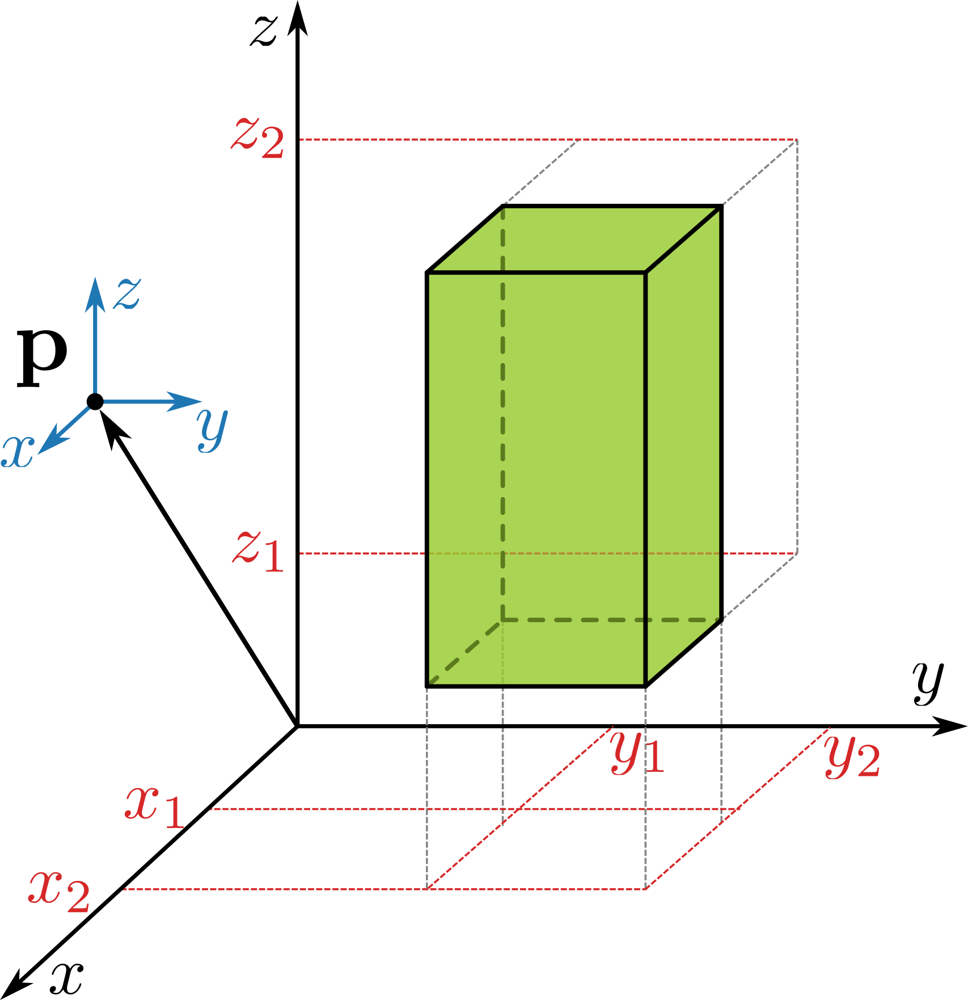

<!-- .slide: class="center" -->

# AQGEO 2024: A tour on potential fields modelling

## Santiago Soler

### UBC-GIF

November 7, 2024

---

## Layout

1. Recap on gravity and magnetic fields.
1. Analytic solutions for rectangular prisms.
1. Implementation for a single source and single receiver.
1. SimPEG: implementation for regular meshes.
1. Inversion.

---

## Motivation

> Maybe add a motivation slide, showing that we usually measure data above the
> earth surface, we remove the normal earth and the igrf field, so we can get the
> signal of bodies with anomalous densities or magnetized bodies.

---

## Recap on gravity and magnetic fields

> Image of arbitrary body, with density and magnetization.
> General equations for gravity and magnetic fields generated by it.

<div class="container">
<div class="col-1">

### Gravity fields

Gravity potential:

$$
V(\mathbf{p}) =
    G \int\limits_\Gamma
        \frac{\rho}{|\mathbf{p} - \mathbf{q}|}
    \text{d}\mathbf{q}
$$

### Magnetic fields

Assume no currents: $ \nabla_\mathbf{p} \times \mathbf{B} = 0 $

Magnetic field:

$$
\mathbf{B}(\mathbf{p}) =
    -\frac{\mu_0}{4\pi}
    \nabla_\mathbf{p}
    \int\limits_\Gamma
    \mathbf{M}
    \cdot
    \nabla_\mathbf{q}
    \left(
        \frac{1}{|\mathbf{p} - \mathbf{q}|}
    \right)
    \text{d}\mathbf{q}
$$

</div>
<div class="col-1">

Image

</div>

</div>

---

## Analytic solutions for rectangular prisms

<!--
> We usually discretize the subsurface using regular meshes. In SimPEG we use
> regular meshes with rectangular cells.
> We assign a constant physical property to each one of the meshes.
> We need a way to compute the fields that the mesh generates on observation
> points in the survey.
-->


* Discretize the subsurface using **regular meshes** with **rectangular cells**.
* Each cell: **homogeneous physical property**.
* Need to **compute the fields** generated by the mesh.
  * **Analytic solutions** of gravity and magnetic fields for **rectangular
    prisms**.

---

<!-- .slide: class="center" -->

## Analytic solutions: gravity fields

---

## Analytic solutions: gravity fields

<!--
> Analytic solution to the gravity potential and acceleration components.
> Move the coordinate system to the next slide
-->

<div class="container">
<div class="col-1">

* Gravity potential:
  $$
  \begin{align*}
  V(\mathbf{p}) &=
    G \int\limits_\Gamma
        \frac{\rho}{|\mathbf{p} - \mathbf{q}|}
    \text{d}\mathbf{q}
    \newline
    & = G\rho
    \int\limits_{x_1}^{x_2}
    \int\limits_{y_1}^{y_2}
    \int\limits_{z_1}^{z_2}
      \frac{ 1 }{ |\mathbf{p} - \mathbf{q}| }
      \text{d}\mathbf{q}
  \end{align*}
  $$
* Gravity acceleration:
  $$ \mathbf{g}(\mathbf{p}) = \nabla_\mathbf{p} V(\mathbf{p}) $$
  $$
  g_x = \frac{\partial V}{\partial x_p}, \\,
  g_y = \frac{\partial V}{\partial y_p}, \\,
  g_z = \frac{\partial V}{\partial z_p}
  $$

</div>
<div class="col-1">



</div>
</div>


<div>
<p class="box-pink" style="width: 70%; margin: auto">
<strong>
Solve the gravity potential, then derive the acceleration components.
</strong>
</p>
</div>

---

## Analytic solutions: gravity fields

<div class="container">
<div class="col-1 align-left text-sm">

Coordinate system located on $\mathbf{p}$:

$$
\begin{cases}
x = x_q - x_p \newline
y = y_q - y_p \newline
z = z_q - z_p
\end{cases}
$$

Gravity potential:
$$
V(\mathbf{p}) =
  G \int\limits_\Gamma
      \frac{\rho}{|\mathbf{p} - \mathbf{q}|}
  \text{d}\mathbf{q}
$$
$$
V(\mathbf{p}) =
  G\rho
  \int_{x_1}^{x_2}
  \int_{y_1}^{y_2}
  \int_{z_1}^{z_2}
    \frac{
      \text{d}x \\,
      \text{d}y \\,
      \text{d}z
    }{
      \sqrt{x^2 + y^2 + z^2}
    }
$$

Define $u(\mathbf{p})$ as:
$$
V(\mathbf{p}) = G\rho \\, u(\mathbf{p})
$$


</div>
<div class="col-1">


</div>

</div>

---

## Analytic solutions: gravity fields

<div class="align-left text-sm">

The $u(\mathbf{p})$ is given by:

$$
u(\mathbf{p}) =
  \int_{x_1}^{x_2}
  \int_{y_1}^{y_2}
  \int_{z_1}^{z_2}
    \frac{
      \text{d}x \\,
      \text{d}y \\,
      \text{d}z
    }{
      \sqrt{x^2 + y^2 + z^2}
    }
$$


Analytic solutions for $u(\mathbf{p})$ _(Nagy et al., 2000)_:

$$
u(\mathbf{p}) =
\Bigl\lvert
\Bigl\lvert
\Bigl\lvert
k(x, y, z)
\Bigl\rvert_{x_1}^{x_2}
\Bigl\rvert_{y_1}^{y_2}
\Bigl\rvert_{z_1}^{z_2}
$$

where

$$
\begin{align*}
k(x, y, z) = \\, & x y \ln(z + r)
    + y z \ln(x + r)
    + z x \ln(y + r)
    \newline
    &- \frac{x^2}{2} \arctan \left( \frac{y z}{x r} \right)
    - \frac{y^2}{2} \arctan \left( \frac{x z}{y r} \right)
    - \frac{z^2}{2} \arctan \left( \frac{x y}{z r} \right),
\end{align*}
$$

$$
r = \sqrt{x^2 + y^2 + z^2}.
$$

<div class="box-purple" style="text-align: center;">

We refer to $k(x, y, z)$ as a **kernel** function.

</div>

</div>

---

## Analytic solutions: gravity fields

<div class="container">
<div class="col-1 align-left text-sm">

Gravity acceleration components:

$$
\begin{align*}
g_x(\mathbf{p}) &= G\rho \\, u_x(\mathbf{p})
\newline
g_y(\mathbf{p}) &= G\rho \\, u_y(\mathbf{p})
\newline
g_z(\mathbf{p}) &= G\rho \\, u_z(\mathbf{p})
\end{align*}
$$

where:

$$
\begin{align*}
u_x(\mathbf{p}) &=
\Bigl\lvert \Bigl\lvert \Bigl\lvert
k_x(x, y, z)
\Bigl\rvert_{x_1}^{x_2} \Bigl\rvert_{y_1}^{y_2} \Bigl\rvert_{z_1}^{z_2}
\newline
u_y(\mathbf{p}) &=
\Bigl\lvert \Bigl\lvert \Bigl\lvert
k_y(x, y, z)
\Bigl\rvert_{x_1}^{x_2} \Bigl\rvert_{y_1}^{y_2} \Bigl\rvert_{z_1}^{z_2}
\newline
u_z(\mathbf{p}) &=
\Bigl\lvert \Bigl\lvert \Bigl\lvert
k_z(x, y, z)
\Bigl\rvert_{x_1}^{x_2} \Bigl\rvert_{y_1}^{y_2} \Bigl\rvert_{z_1}^{z_2}
\end{align*}
$$

</div>
<div class="col-1 align-left text-sm">

The first-order kernels are given by:

$$
\begin{align*}
k_x(x, y, z) &=
-\left[ y \ln(z + r) + z \ln(y + r) - x \arctan \left( \frac{y z}{x r}\right) \right]
\newline
k_y(x, y, z) &=
-\left[ z \ln(x + r) + x \ln(z + r) - y \arctan \left( \frac{x z}{y r}\right) \right]
\newline
k_z(x, y, z) &=
-\left[ x \ln(y + r) + y \ln(x + r) - z \arctan \left( \frac{x y}{z r}\right) \right]
\end{align*}
$$

</div>
</div>

---

<!-- .slide: class="center" -->

## Gravity fields: <br> simple implementation

---

### Gravity fields: simple implementation

<!-- > Show a dumb implementation of the gravity fields. -->

Let's write some code that computes the **vertical acceleration** due to
a **prism** on an observation point.

<!-- $$ -->
<!-- k_z(x, y, z) = -->
<!-- x \ln(y + r) + y \ln(x + r) - z \arctan \left( \frac{x y}{z r}\right) -->
<!-- $$ -->

Define prism: <!-- .element: class="align-left" -->

```python
west, east = -10.0, 10.0
south, north = -12.0, 12.0
bottom, top = -15.0, -5.0
prism = [west, east, south, north, bottom, top]
```

Define observation point: <!-- .element: class="align-left" -->

```python
coordinates = (0.0, 0.0, 2.0)
```

Implement a kernel function: <!-- .element: class="align-left" -->

```python
import numpy as np

def kernel_z(x, y, z):
    r = np.sqrt(x**2 + y**2 + z**2)
    result = -(x * np.log(y + r) + y * np.log(x + r) - z * np.arctan(x * y / z / r))
    return result
```

---

### Gravity fields: simple implementation

Define a function to evaluate the kernel on the nodes of the prism:

<pre>
<code
data-trim
data-noescape
data-line-numbers="|1|2-3|5-6|8-11|12-15|16-19|21|"
class="python hljs noscroll"
>
def evaluate_kernel(coordinates, prism, kernel):
    # Extract the coordinates of the observation point
    easting, northing, upward = coordinates

    # Initialize a result value equal to zero
    result = 0.0

    # Iterate over the vertices of the prism
    for i in range(2):
        for j in range(2):
            for k in range(2):
                # Compute shifted coordinates
                shift_east = prism[1 - i] - easting
                shift_north = prism[3 - j] - northing
                shift_upward = prism[5 - k] - upward
                # Evaluate kernel. Use the right sign.
                result += (-1) ** (i + j + k) * kernel(
                    shift_east, shift_north, shift_upward
                )

    return result
</code></pre>

---

### Gravity fields: simple implementation

Finally, define a function to compute the gravity acceleration of the prism:

```python
G = 6.6743e-11  # gravitational constant

def gravity_z(coordinates, prism, density):
    u_z = evaluate_kernel(coordinates, prism, kernel_z)
    return G * density * u_z
```

Now we can use this function to compute the vertical acceleration due to the
prism on the observation point:

```python
density = 2900.0 # kg/m3
gz = gravity_z(coordinates, prism, density)
print(f"{gz} m/s2")
```

```bash
-3.820956349021657e-06 m/s2
```

<div class="box-purple">

The result is negative because this is the **upward** acceleration component.

</div>

---

### Gravity fields: simple implementation

Let's modify the `gravity_z` function to handle multiple observation points:

<pre>
<code
data-trim
data-noescape
data-line-numbers
class="python hljs noscroll"
>
def gravity_z(coordinates, prism, density):
    easting, northing, upward = coordinates
    # Initialize an array of results
    result = np.empty(easting.size)
    # Iterate over the observation points
    for i in range(easting.size):
        # Evaluate the kernel for the current observation point
        u_z = evaluate_kernel(
          (easting[i], northing[i], upward[i]), prism, kernel_z
        )
        # Add result to the array
        result[i] = G * density * u_z
    return result
</code>
</pre>

---

### Gravity fields: simple implementation

Use it to compute $g_z$ on a grid of observation points:

<div class="container">

<div class="col-1">

<pre>
<code
data-trim
data-noescape
data-line-numbers="|1-4|6-7|9-14|16-17|"
class="python hljs noscroll"
>
# Build grid of observation points
easting = np.linspace(-30.0, 30.0, 121)
northing = np.linspace(-30.0, 30.0, 121)
easting, northing = np.meshgrid(easting, northing)

# All points are at constant height
upward = 2.0 * np.ones_like(easting)

# Put the coordinates inside a new variable
coordinates = (
  easting.ravel(),
  northing.ravel(),
  upward.ravel()
)

# Compute gz
gz = gravity_z(coordinates, prism, density)
</code>
</pre>

</div>

<div class="col-1">

</div>

</div>

---

<!-- .slide: class="center" -->

## Issues of this implementation

---

## Singular points

The gravitational potential $V$ and the acceleration $\mathbf{g}$ are defined
in every point of space.

But the **solutions $u(x, y, z)$ are not**.

$$
g_z(\mathbf{p}) = G\rho \\, u_z(\mathbf{p}),
\quad
u_z(\mathbf{p}) =
\Bigl\lvert \Bigl\lvert \Bigl\lvert
k_z(x, y, z)
\Bigl\rvert_{x_1}^{x_2} \Bigl\rvert_{y_1}^{y_2} \Bigl\rvert_{z_1}^{z_2}
$$

$$
k_z(x, y, z) =
-\left[ x \ln(y + r) + y \ln(x + r) - z \arctan \left( \frac{x y}{z r}\right) \right]
$$

$u_z$ is not defined when for any of the vertices:
1. $r=0$ _(prism vertices)_,
1. $z=0$ and $x \ne 0$ or $y \ne 0$ _(planes of horizontal faces)_,
1. $x=-r$ or $y=-r$ _(lines along horizontal edges)_.

In such cases, we need to **evaluate the limits of $u_z$** approaching those
points.

---

## Singular points

For the potential $V$ and the acceleration $\mathbf{g}$, all singular terms
have **finite limits** equal **to zero**.

$$
\lim\limits_{(x_p, y_p, z_p) \to (x_1, y_1, z_1)} u_z(\mathbf{p}) =
\lim\limits_{(x_p, y_p, z_p) \to (x_1, y_1, z_1)} \\, \\,
\Bigl\lvert \Bigl\lvert \Bigl\lvert
k_z(x, y, z)
\Bigl\rvert_{x_1}^{x_2} \Bigl\rvert_{y_1}^{y_2} \Bigl\rvert_{z_1}^{z_2}
$$

<div class="container">
<div class="col-1">

One of the singular **$\ln$** terms:

$$
\lim\limits_{(x, y, z) \to (0, 0, 0)} \\,
x \ln(y + r) = 0
$$

$$
\lim\limits_{(x, z) \to (0, 0)} \\,
x \ln(y + \sqrt{x^2 + y^2 + z^2}) = 0
$$

</div>
<div class="col-1">

One of the singular **$\arctan$** terms:

$$
\lim\limits_{(x, y, z) \to (0, 0, 0)} \\,
z \arctan \left( \frac{xy}{zr} \right) = 0
$$

</div>
</div>


<div class="box-purple">

We need to evaluate these **limits** in our **implementation**.
</div>

---

## Singular points: limits in implementation

One possible solution: define custom functions for the **$\ln$** and
**$\arctan$**:

```python
def safe_log(x, r):
    if r == 0.0:
      return 0.0
    if x == -r:
      return 0.0
    return np.log(x + r)

def safe_arctan(num, den):
    if den == 0.0:
        return 0.0
    return np.arctan(num / den)
```

Use these instead of `np.log` and `np.arctan` in our implementation of the
**kernel function**:

```python
def kernel_z(x, y, z):
    r = np.sqrt(x**2 + y**2 + z**2)
    result = -(
        x * safe_log(y, r)
        + y * safe_log(x, r)
        - z * safe_arctan(x * y , z * r)
    )
    return result
```

---

## Numerical instabilities

<div class="container">

<div class="col-1 text-sm">

Let's consider the case in which the observation point is _almost_ in one of
the lines along the horizontal edges.

The **shifted coordinates** of the **two vertices** in that line are going to
be:

$$
v_1 = (x_1, \delta y, 0)
\newline
v_2 = (x_2, \delta y, 0)
$$

where $x_1 < x_2 < 0$ and **$\delta y \ll 1$**.

The distance from observation point to each vertex:

$$
r_1 = \sqrt{x_1^2 + \delta y^2}
\newline
r_2 = \sqrt{x_2^2 + \delta y^2 }
$$

</div>
<div class="col-1 text-sm">

> Image of prism with observation point?

</div>

</div>

---

## Numerical instabilities

<div class="container gap">

<div class="col-1 text-sm">

In code:

```python
x1, x2 = -70, -50
delta_y = 1e-6

r1 = np.sqrt(x1**2 + delta_y**2)
r2 = np.sqrt(x2**2 + delta_y**2)
print(f"{r1=}")
print(f"{r2=}")
```
```bash
r1=70.0
r2=50.00000000000001
```

So `r2 != x1`, but `r1 == x1`

<div class="box-purple">

We fall under machine precision when computing **`r1`**.

</div>

We defined the `safe_log` function as follows:

<pre>
<code
data-trim
data-noescape
data-line-numbers="|4-5|6|"
class="python hljs noscroll"
>
def safe_log(x, r):
    if r == 0.0:
      return 0.0
    if x == -r:
      return 0.0
    return np.log(x + r)
</code>
</pre>

</div>
<div class="col-1 text-sm">

Evaluating `safe_log` on these two points:
1. will return **0.0**
2. will return the `np.log(x2 + r2)`

<div class="box-orange" style="margin-bottom: 1em;">

Will lead to **invalid evaluation** of the fields.

</div>


### We can fix it!

<pre>
<code
data-trim
data-noescape
data-line-numbers="|1,4-5|"
class="python hljs noscroll"
>
def safe_log(x, y, z, r):
    if r == 0.0:
      return 0.0
    if y == 0.0 and z == 0.0:
      return 0.0
    return np.log(x + r)
</code>
</pre>

</div>
</div>

---


<!-- .slide: class="center" -->

## Analytic solutions: magnetic fields

---

## Analytic solutions: magnetic fields

<!--
> Analytic solution to the magnetic field components.
-->

<div class="text-sm">

Magnetic field:

$$
\mathbf{B}(\mathbf{p}) =
    -\frac{\mu_0}{4\pi}
    \nabla_\mathbf{p}
    \int\limits_\Gamma
    \mathbf{M}
    \cdot
    \nabla_\mathbf{q}
    \left(
        \frac{1}{|\mathbf{p} - \mathbf{q}|}
    \right)
    \text{d}\mathbf{q}
$$

$$
\mathbf{B}(\mathbf{p}) =
    \frac{\mu_0}{4\pi}
    \nabla_\mathbf{p}
    \int\limits_{x_1}^{x_2}
    \int\limits_{y_1}^{y_2}
    \int\limits_{z_1}^{z_2}
    \mathbf{M}
    \cdot
    \nabla_\mathbf{p}
    \left(
        \frac{1}{|\mathbf{p} - \mathbf{q}|}
    \right)
    \text{d}\mathbf{q}
$$

One component:

$$
B_x(\mathbf{p}) =
\frac{\mu_0}{4\pi}
\sum\limits_{i \in \\{x, y, z\\}}
M_i
\\,
\underbrace{
\frac{\partial^2}{\partial x \partial i}
\int\limits_{x_1}^{x_2}
\int\limits_{y_1}^{y_2}
\int\limits_{z_1}^{z_2}
    \frac{1}{|\mathbf{p} - \mathbf{q}|}
\text{d}\mathbf{q}
}_{\text{derivatives of } u(\mathbf{p})}
$$

$$
B_x(\mathbf{p}) =
\frac{\mu_0}{4\pi}
\sum\limits_{i \in \\{x, y, z\\}}
M_i u_{xi}(\mathbf{p})
$$

</div>

---

## Analytic solutions: magnetic fields

<div class="container text-sm">

<div class="col-1">

We can write these expressions as a **dot product** between a **matrix** and
the **magnetization vector**:

$$
\mathbf{B}(\mathbf{p}) =
\frac{\mu_0}{4\pi}
\\,
\mathbf{U}(\mathbf{p})
\cdot
\mathbf{M}
$$

$$
\mathbf{B}(\mathbf{p}) =
\frac{\mu_0}{4\pi}
\\,
\begin{bmatrix}
    u_{xx}(\mathbf{p}) & u_{xy}(\mathbf{p}) & u_{xz}(\mathbf{p}) \newline
    u_{xy}(\mathbf{p}) & u_{yy}(\mathbf{p}) & u_{yz}(\mathbf{p}) \newline
    u_{xz}(\mathbf{p}) & u_{yz}(\mathbf{p}) & u_{zz}(\mathbf{p})
\end{bmatrix}
\cdot
\begin{bmatrix}
    M_x \newline
    M_y \newline
    M_z
\end{bmatrix}
$$

The **$u_{\alpha\beta}(\mathbf{p})$** are the **second derivatives** of the
**$u(\mathbf{p})$**:

$$
u_{\alpha\beta}(\mathbf{p}) =
\frac{\partial^2 u(\mathbf{p})}{\partial \alpha \\, \partial \beta},
\quad
\alpha, \beta \in \\{x, y, z\\}
$$

They have **analytic solutions**:

$$
u_{\alpha\beta}(\mathbf{p}) =
\Bigl\lvert
\Bigl\lvert
\Bigl\lvert
k_{\alpha\beta}(x, y, z)
\Bigl\rvert_{x_1}^{x_2}
\Bigl\rvert_{y_1}^{y_2}
\Bigl\rvert_{z_1}^{z_2}
$$

</div>
<div class="col-1">

**Second-order kernels:**

$$
\begin{align*}
k_{xx}(\mathbf{p}) &= -\arctan\left( \frac{yz}{xr} \right)
\newline
k_{yy}(\mathbf{p}) &= -\arctan\left( \frac{xz}{yr} \right)
\newline
k_{zz}(\mathbf{p}) &= -\arctan\left( \frac{xy}{zr} \right)
\newline
k_{xy}(\mathbf{p}) &= \ln(z + r)
\newline
k_{xz}(\mathbf{p}) &= \ln(y + r)
\newline
k_{yz}(\mathbf{p}) &= \ln(x + r)
\newline
\end{align*}
$$

</div>

</div>

---

## Software implementations

> Talk about some details of the implementation.
> Numerical accuracy.
> Limits. Singular points.

---

## Choclo

> Introduce the package, the need for it. Combining efforts from SimPEG and
> Fatiando to build tools that are used by the two projects.

---

## Forward modelling on regular meshes

> How we actually forward model potential fields in SimPEG meshes.

---

## Thank you
