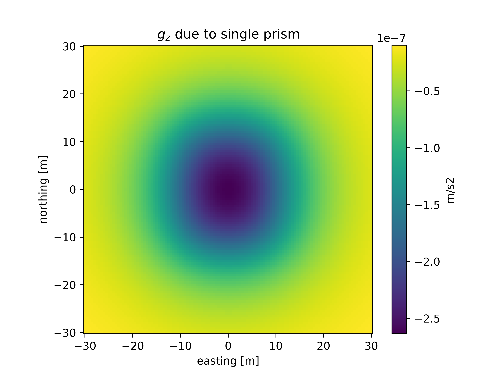

<!-- .slide: class="center" -->

# AQGEO 2024: A tour on potential fields modelling

## Santiago Soler

### UBC-GIF

November 7, 2024

---

<!-- .slide: class="center" -->

## Layout

<div class="text-lg list">

<ol>
  <li class="fragment">
  Recap on gravity and magnetic fields.
  </li>
  <li class="fragment">
  Analytic solutions for rectangular prisms.
  </li>
  <li class="fragment">
  Software implementation.
  </li>
  <li class="fragment">
  Optimizations to the code.
  </li>
  <li class="fragment">
  Forward modelling the fields of a regular mesh.
  </li>
  <li class="fragment">
  Demo: forward modelling with SimPEG.
  </li>
  <li class="fragment">
  Demo: running inversion with SimPEG.
  </li>
</ol>

</div>

---

<!-- .slide: class="center" -->

## Motivation

<!--
> Maybe add a motivation slide, showing that we usually measure data above the
> earth surface, we remove the normal earth and the igrf field, so we can get the
> signal of bodies with anomalous densities or magnetized bodies.
-->

<div class="container">

<div class="list d-flex justify-center align-center flex-column">

* **Magnetic data** is the most available geophysical data.
* **Gravity data** is usually available.
* Higher **data quality** requires _accurate forward modelling_.
* Higher **computation power** allows us to work on _larger problems_:
    * Larger **areas**.
    * Data with **higher resolution**.
* Inversion of **gravity** and **magnetic** data are the most common.
    * _Efficient code_ helps to reduce the required computational power.
    * Saves _time_ and _energy_.

</div>
<div style="width: 40%;">


</div>

</div>

---

<!-- .slide: class="center" -->

## Motivation

<div class="list">

* **3D gravity** and **magnetic** forward modelling codes available _since the 90s_.
* In order to get code that is:
  * Accurate,
  * Efficient,
  * Easy to use,
  * Easy to extend,
  * Easy to parallelize and distribute.

</div>

<div class="box-orange" style="width: 50%; margin: auto auto;">
We need to get into the details of the method.
</div>

---

<!-- .slide: class="center" -->

## Recap on gravity and magnetic fields

---

## Gravity and magnetic data

<div class="container r-stretch align-center">
<div class="list">

* Data gathered _on ground_ or _airbone_.
* Observed fields reflect the presence of _anomalous bodies_.
* In order to **invert** for those bodies:
    * Compute the **gravity** and **mangetic** fields they generate.

</div>

<div style="width: 60%;">

</div>
</div>

---

## Gravity and magnetic fields

<div class="container r-stretch">
<div class="col-1">

### Gravity fields

Gravity potential:

$$
V(\mathbf{p}) =
    G \int\limits_\Gamma
        \frac{\rho}{|\mathbf{p} - \mathbf{q}|}
    \text{d}\mathbf{q}
$$

### Magnetic fields

Assume no currents: $ \nabla_\mathbf{p} \times \mathbf{B} = 0 $

Magnetic field:

$$
\mathbf{B}(\mathbf{p}) =
    -\frac{\mu_0}{4\pi}
    \nabla_\mathbf{p}
    \int\limits_\Gamma
    \mathbf{M}
    \cdot
    \nabla_\mathbf{q}
    \left(
        \frac{1}{|\mathbf{p} - \mathbf{q}|}
    \right)
    \text{d}\mathbf{q}
$$

</div>
<div class="col-1">


</div>

</div>

---

## Discretize the subsurface: Regular meshes


* Discretize the subsurface using **regular meshes** with **rectangular cells**.
* Each cell: **homogeneous physical property**.
* Need to **compute the fields** generated by the mesh.
  * **Analytic solutions** of gravity and magnetic fields for **rectangular
    prisms**.

---

<!-- .slide: class="center" -->

## Analytic solutions: gravity fields

---

## Analytic solutions: gravity fields

<!--
> Analytic solution to the gravity potential and acceleration components.
> Move the coordinate system to the next slide
-->

<div class="container">
<div class="col-1">

* Gravity potential:
  $$
  \begin{align*}
  V(\mathbf{p}) &=
    G \int\limits_\Gamma
        \frac{\rho}{|\mathbf{p} - \mathbf{q}|}
    \text{d}\mathbf{q}
    \newline
    & = G\rho
    \int\limits_{x_1}^{x_2}
    \int\limits_{y_1}^{y_2}
    \int\limits_{z_1}^{z_2}
      \frac{ 1 }{ |\mathbf{p} - \mathbf{q}| }
      \text{d}\mathbf{q}
  \end{align*}
  $$
* Gravity acceleration:
  $$ \mathbf{g}(\mathbf{p}) = \nabla_\mathbf{p} V(\mathbf{p}) $$
  $$
  g_x = \frac{\partial V}{\partial x_p}, \\,
  g_y = \frac{\partial V}{\partial y_p}, \\,
  g_z = \frac{\partial V}{\partial z_p}
  $$

</div>
<div class="col-1">


</div>
</div>


<div>
<p class="box-pink" style="width: 70%; margin: auto">
<strong>
Solve the gravity potential, then derive the acceleration components.
</strong>
</p>
</div>

---

## Analytic solutions: gravity fields

<div class="container">
<div class="col-1 align-left text-sm">

Coordinate system located on $\mathbf{p}$:

$$
\begin{cases}
x = x_q - x_p \newline
y = y_q - y_p \newline
z = z_q - z_p
\end{cases}
$$

Gravity potential:
$$
V(\mathbf{p}) =
  G \int\limits_\Gamma
      \frac{\rho}{|\mathbf{p} - \mathbf{q}|}
  \text{d}\mathbf{q}
$$
$$
V(\mathbf{p}) =
  G\rho
  \int_{x_1}^{x_2}
  \int_{y_1}^{y_2}
  \int_{z_1}^{z_2}
    \frac{
      \text{d}x \\,
      \text{d}y \\,
      \text{d}z
    }{
      \sqrt{x^2 + y^2 + z^2}
    }
$$

Define $u(\mathbf{p})$ as:
$$
V(\mathbf{p}) = G\rho \\, u(\mathbf{p})
$$


</div>
<div class="col-1">


</div>

</div>

---

## Analytic solutions: gravity fields

<div class="align-left text-sm">

The $u(\mathbf{p})$ is given by:

$$
u(\mathbf{p}) =
  \int_{x_1}^{x_2}
  \int_{y_1}^{y_2}
  \int_{z_1}^{z_2}
    \frac{
      \text{d}x \\,
      \text{d}y \\,
      \text{d}z
    }{
      \sqrt{x^2 + y^2 + z^2}
    }
$$


Analytic solutions for $u(\mathbf{p})$ _(Nagy et al., 2000)_:

$$
u(\mathbf{p}) =
\Bigl\lvert
\Bigl\lvert
\Bigl\lvert
k(x, y, z)
\Bigl\rvert_{x_1}^{x_2}
\Bigl\rvert_{y_1}^{y_2}
\Bigl\rvert_{z_1}^{z_2}
$$

where

$$
\begin{align*}
k(x, y, z) = \\, & x y \ln(z + r)
    + y z \ln(x + r)
    + z x \ln(y + r)
    \newline
    &- \frac{x^2}{2} \arctan \left( \frac{y z}{x r} \right)
    - \frac{y^2}{2} \arctan \left( \frac{x z}{y r} \right)
    - \frac{z^2}{2} \arctan \left( \frac{x y}{z r} \right),
\end{align*}
$$

$$
r = \sqrt{x^2 + y^2 + z^2}.
$$

<div class="box-purple" style="text-align: center;">

We refer to $k(x, y, z)$ as a **kernel** function.

</div>

</div>

---

## Analytic solutions: gravity fields

<div class="container">
<div class="col-1 align-left text-sm">

**Gravity acceleration** components:

$$
\begin{align*}
g_x(\mathbf{p}) &= G\rho \\, u_x(\mathbf{p})
\newline
g_y(\mathbf{p}) &= G\rho \\, u_y(\mathbf{p})
\newline
g_z(\mathbf{p}) &= G\rho \\, u_z(\mathbf{p})
\end{align*}
$$

where:

$$
\begin{align*}
u_x(\mathbf{p}) &=
\Bigl\lvert \Bigl\lvert \Bigl\lvert
k_x(x, y, z)
\Bigl\rvert_{x_1}^{x_2} \Bigl\rvert_{y_1}^{y_2} \Bigl\rvert_{z_1}^{z_2}
\newline
u_y(\mathbf{p}) &=
\Bigl\lvert \Bigl\lvert \Bigl\lvert
k_y(x, y, z)
\Bigl\rvert_{x_1}^{x_2} \Bigl\rvert_{y_1}^{y_2} \Bigl\rvert_{z_1}^{z_2}
\newline
u_z(\mathbf{p}) &=
\Bigl\lvert \Bigl\lvert \Bigl\lvert
k_z(x, y, z)
\Bigl\rvert_{x_1}^{x_2} \Bigl\rvert_{y_1}^{y_2} \Bigl\rvert_{z_1}^{z_2}
\end{align*}
$$

</div>
<div class="col-1 align-left text-sm">

The **first-order kernels** are given by:

$$
\begin{align*}
k_x(x, y, z) &=
-\left[ y \ln(z + r) + z \ln(y + r) - x \arctan \left( \frac{y z}{x r}\right) \right]
\newline
k_y(x, y, z) &=
-\left[ z \ln(x + r) + x \ln(z + r) - y \arctan \left( \frac{x z}{y r}\right) \right]
\newline
k_z(x, y, z) &=
-\left[ x \ln(y + r) + y \ln(x + r) - z \arctan \left( \frac{x y}{z r}\right) \right]
\end{align*}
$$

</div>
</div>

---

<!-- .slide: class="center" -->

## Gravity fields: <br> simple implementation

---

### Gravity fields: simple implementation

<!-- > Show a dumb implementation of the gravity fields. -->

Let's write some code that computes the **vertical acceleration** due to
a **prism** on an observation point.

<div class="fragment">

Define prism: <!-- .element: class="align-left" -->

```python
west, east = -10.0, 10.0
south, north = -12.0, 12.0
bottom, top = -15.0, -5.0
prism = [west, east, south, north, bottom, top]
```

</div>
<div class="fragment">

Define observation point: <!-- .element: class="align-left" -->

```python
coordinates = (0.0, 0.0, 2.0)
```

</div>
<div class="fragment">

Implement a kernel function: <!-- .element: class="align-left" -->

```python
import numpy as np

def kernel_z(x, y, z):
    r = np.sqrt(x**2 + y**2 + z**2)
    result = -(x * np.log(y + r) + y * np.log(x + r) - z * np.arctan(x * y / z / r))
    return result
```

</div>

---

### Gravity fields: simple implementation

Define a function to evaluate the kernel on the nodes of the prism:

<pre>
<code
data-trim
data-noescape
data-line-numbers="|1|2-3|5-6|8-11|12-15|16-19|21|"
class="python hljs noscroll"
>
def evaluate_kernel(coordinates, prism, kernel):
    # Extract the coordinates of the observation point
    easting, northing, upward = coordinates

    # Initialize a result value equal to zero
    result = 0.0

    # Iterate over the vertices of the prism
    for i in range(2):
        for j in range(2):
            for k in range(2):
                # Compute shifted coordinates
                shift_east = prism[1 - i] - easting
                shift_north = prism[3 - j] - northing
                shift_upward = prism[5 - k] - upward
                # Evaluate kernel. Use the right sign.
                result += (-1) ** (i + j + k) * kernel(
                    shift_east, shift_north, shift_upward
                )

    return result
</code></pre>

---

### Gravity fields: simple implementation

<div class="text-sm">

Finally, define a function to compute the gravity acceleration of the prism:

```python
G = 6.6743e-11  # gravitational constant

def gravity_z(coordinates, prism, density):
    u_z = evaluate_kernel(coordinates, prism, kernel_z)
    return G * density * u_z
```

<div class="fragment">

Now we can use this function to compute the vertical acceleration due to the
prism on the observation point:

```python
# Define the prism
prism = [-10.0, 10.0, -12.0, 12.0, -15.0, -5.0]

# Define the density contrast for the prism
density = 200.0 # kg/m3

# Define the coordinates of the observation point
coordinates = (0.0, 0.0, 2.0)

# Compute the vertical acceleration
gz = gravity_z(coordinates, prism, density)
print(f"{gz} m/s2")
```

</div>
<div class="fragment">

```bash
-2.635142309670108e-07 m/s2
```

<div class="box-purple">

The result is negative because this is the **upward** acceleration component.

</div>

</div>

</div>

---

### Gravity fields: simple implementation

Use it to compute $g_z$ on a grid of observation points:



---

<!-- .slide: class="center" -->

## Issues of this implementation

---

## Singular points

<div class="text-sm">

The gravitational potential $V$ and the acceleration $\mathbf{g}$ are defined
in every point of space.

But the **solutions $u(x, y, z)$ are not**.

$$
g_z(\mathbf{p}) = G\rho \\, u_z(\mathbf{p}),
\quad
u_z(\mathbf{p}) =
\Bigl\lvert \Bigl\lvert \Bigl\lvert
k_z(x, y, z)
\Bigl\rvert_{x_1}^{x_2} \Bigl\rvert_{y_1}^{y_2} \Bigl\rvert_{z_1}^{z_2}
$$

$$
k_z(x, y, z) =
-\left[ x \ln(y + r) + y \ln(x + r) - z \arctan \left( \frac{x y}{z r}\right) \right]
$$

<div class="fragment">

<div class="container">

<div class="col-1">

$u_z$ is not defined when for any of the vertices:
1. $r=0$ _(prism vertices)_,
1. $z=0$ and $x \ne 0$ or $y \ne 0$ _(planes of horizontal faces)_,
1. $x=-r$ or $y=-r$ _(lines along horizontal edges)_.


<div class="fragment">

In such cases, we need to **evaluate the limits of $u_z$** approaching those
points.

</div> <!-- fragment -->

</div> <!-- col-1 -->

<div class="col-1">


</div>

</div> <!-- container -->

</div> <!-- fragment -->

</div> <!-- text-sm -->

---

## Singular points

Evaluate the `gravity_z` function on a grid located on the top face of the
prism.


---

## Singular points

For the **potential $V$** and the **acceleration $\mathbf{g}$**, all singular
terms have **finite limits** equal **to zero**.

$$
\lim\limits_{(x_p, y_p, z_p) \to (x_1, y_1, z_1)} u_z(\mathbf{p}) =
\lim\limits_{(x_p, y_p, z_p) \to (x_1, y_1, z_1)} \\, \\,
\Bigl\lvert \Bigl\lvert \Bigl\lvert
k_z(x, y, z)
\Bigl\rvert_{x_1}^{x_2} \Bigl\rvert_{y_1}^{y_2} \Bigl\rvert_{z_1}^{z_2}
$$

<div class="container">
<div class="fragment col-1">

One of the singular **$\ln$** terms:

$$
\lim\limits_{(x, y, z) \to (0, 0, 0)} \\,
x \ln(y + r) = 0
$$

$$
\lim\limits_{(x, z) \to (0, 0)} \\,
x \ln(y + \sqrt{x^2 + y^2 + z^2}) = 0
$$

</div>
<div class="fragment col-1">

One of the singular **$\arctan$** terms:

$$
\lim\limits_{(x, y, z) \to (0, 0, 0)} \\,
z \arctan \left( \frac{xy}{zr} \right) = 0
$$

</div>
</div>


<div class="fragment box-purple">

We need to evaluate these **limits** in our **implementation**.
</div>

---

## Singular points: limits in implementation

One possible solution: define custom functions for the **$\ln$** and
**$\arctan$**:

```python
def safe_log(x, r):
    if r == 0.0:
      return 0.0
    if x == -r:
      return 0.0
    return np.log(x + r)

def safe_arctan(num, den):
    if den == 0.0:
        return 0.0
    return np.arctan(num / den)
```

<div class="fragment">

Use these instead of `np.log` and `np.arctan` in our implementation of the
**kernel function**:

```python
def kernel_z(x, y, z):
    r = np.sqrt(x**2 + y**2 + z**2)
    result = -(
        x * safe_log(y, r)
        + y * safe_log(x, r)
        - z * safe_arctan(x * y , z * r)
    )
    return result
```

</div>

---

## Numerical instabilities

<div class="container">

<div class="col-1 text-sm">

Let's consider the case in which the observation point is _almost_ in one of
the lines along the horizontal edges.

The **shifted coordinates** of the **two vertices** in that line are going to
be:

$$
v_1 = (x_1, \delta y, 0)
\newline
v_2 = (x_2, \delta y, 0)
$$

where $x_1 < x_2 < 0$ and **$\delta y \ll 1$**.

The distance from observation point to each vertex:

$$
r_1 = \sqrt{x_1^2 + \delta y^2}
\newline
r_2 = \sqrt{x_2^2 + \delta y^2 }
$$

</div>
<div class="col-1 text-sm">


</div>

</div>

---

## Numerical instabilities

<div class="container gap">

<div class="col-1 text-sm">

<div class="fragment">

In code:

```python
x1, x2 = -70, -50
y = 1e-6
z = 0

r1 = np.sqrt(x1**2 + y**2 + z**2)
r2 = np.sqrt(x2**2 + y**2 + z**2)
print(f"{r1=}")
print(f"{r2=}")
```
```bash
r1=70.0
r2=50.00000000000001
```

</div> <!-- fragment -->
<div class="fragment">

So `r2 != -x2`, but `r1 == -x1`

</div> <!-- fragment -->

<div class="fragment box-purple">

We fall under machine precision when computing **`r1`**.

</div>

</div>
<div class="col-1 text-sm">

<div class="fragment">

We defined the `safe_log` function as follows:

<pre>
<code
data-trim
data-noescape
data-line-numbers="|4-5|6|"
class="python hljs noscroll"
>
def safe_log(x, r):
    if r == 0.0:
      return 0.0
    if x == -r:
      return 0.0
    return np.log(x + r)
</code>
</pre>


Evaluating `safe_log` on these two points:
1. will return **0.0**
2. will return the `np.log(x2 + r2)`

<div class="fragment box-orange" style="margin-bottom: 1em;">

Will lead to **invalid evaluation** of the fields.

</div>

</div> <!-- fragment -->
<div class="fragment">


### We can fix it!

<pre>
<code
data-trim
data-noescape
data-line-numbers="|1,4-5|"
class="python hljs noscroll"
>
def safe_log(x, y, z, r):
    if r == 0.0:
      return 0.0
    if y == 0.0 and z == 0.0:
      return 0.0
    return np.log(x + r)
</code>
</pre>

</div> <!-- fragment -->

</div>
</div>


---

<!-- .slide: class="center" -->

## Analytic solutions: magnetic fields

---

## Analytic solutions: magnetic fields

<!--
> Analytic solution to the magnetic field components.
-->

<div class="container text-sm">

<div class="col-1">

Magnetic field:

$$
\mathbf{B}(\mathbf{p}) =
    -\frac{\mu_0}{4\pi}
    \nabla_\mathbf{p}
    \int\limits_\Gamma
    \mathbf{M}
    \cdot
    \nabla_\mathbf{q}
    \left(
        \frac{1}{|\mathbf{p} - \mathbf{q}|}
    \right)
    \text{d}\mathbf{q}
$$

$$
\mathbf{B}(\mathbf{p}) =
    \frac{\mu_0}{4\pi}
    \nabla_\mathbf{p}
    \int\limits_{x_1}^{x_2}
    \int\limits_{y_1}^{y_2}
    \int\limits_{z_1}^{z_2}
    \mathbf{M}
    \cdot
    \nabla_\mathbf{p}
    \left(
        \frac{1}{|\mathbf{p} - \mathbf{q}|}
    \right)
    \text{d}\mathbf{q}
$$

One component:

$$
B_x(\mathbf{p}) =
\frac{\mu_0}{4\pi}
\sum\limits_{i \in \\{x, y, z\\}}
M_i
\\,
\underbrace{
\frac{\partial^2}{\partial x \partial i}
\int\limits_{x_1}^{x_2}
\int\limits_{y_1}^{y_2}
\int\limits_{z_1}^{z_2}
    \frac{1}{|\mathbf{p} - \mathbf{q}|}
\text{d}\mathbf{q}
}_{\text{derivatives of } u(\mathbf{p})}
$$

$$
B_x(\mathbf{p}) =
\frac{\mu_0}{4\pi}
\sum\limits_{i \in \\{x, y, z\\}}
M_i u_{xi}(\mathbf{p})
$$

</div>
<div class="col-1">


</div>

</div>

---

## Analytic solutions: magnetic fields

<div class="container text-sm">

<div class="col-1">

We can write these expressions as a **dot product** between a **matrix** and
the **magnetization vector**:

$$
\mathbf{B}(\mathbf{p}) =
\frac{\mu_0}{4\pi}
\\,
\mathbf{U}(\mathbf{p})
\cdot
\mathbf{M}
$$

$$
\mathbf{B}(\mathbf{p}) =
\frac{\mu_0}{4\pi}
\\,
\begin{bmatrix}
    u_{xx}(\mathbf{p}) & u_{xy}(\mathbf{p}) & u_{xz}(\mathbf{p}) \newline
    u_{xy}(\mathbf{p}) & u_{yy}(\mathbf{p}) & u_{yz}(\mathbf{p}) \newline
    u_{xz}(\mathbf{p}) & u_{yz}(\mathbf{p}) & u_{zz}(\mathbf{p})
\end{bmatrix}
\cdot
\begin{bmatrix}
    M_x \newline
    M_y \newline
    M_z
\end{bmatrix}
$$

The **$u_{\alpha\beta}(\mathbf{p})$** are the **second derivatives** of the
**$u(\mathbf{p})$**:

$$
u_{\alpha\beta}(\mathbf{p}) =
\frac{\partial^2 u(\mathbf{p})}{\partial \alpha \\, \partial \beta},
\quad
\alpha, \beta \in \\{x, y, z\\}
$$

They have **analytic solutions**:

$$
u_{\alpha\beta}(\mathbf{p}) =
\Bigl\lvert
\Bigl\lvert
\Bigl\lvert
k_{\alpha\beta}(x, y, z)
\Bigl\rvert_{x_1}^{x_2}
\Bigl\rvert_{y_1}^{y_2}
\Bigl\rvert_{z_1}^{z_2}
$$

</div>
<div class="col-1">

**Second-order kernels:**

$$
\begin{align*}
k_{xx}(\mathbf{p}) &= -\arctan\left( \frac{yz}{xr} \right)
\newline
k_{yy}(\mathbf{p}) &= -\arctan\left( \frac{xz}{yr} \right)
\newline
k_{zz}(\mathbf{p}) &= -\arctan\left( \frac{xy}{zr} \right)
\newline
k_{xy}(\mathbf{p}) &= \ln(z + r)
\newline
k_{xz}(\mathbf{p}) &= \ln(y + r)
\newline
k_{yz}(\mathbf{p}) &= \ln(x + r)
\newline
\end{align*}
$$

</div>

</div>

---

## Analytic solutions: magnetic fields

**Second-order kernels** also contain nuances:

* **$\mathbf{B}$ field** is **not defined** on:
  * Prism vertices
  * Prism edges
  * Prism faces
* **$\mathbf{B}$ field** is **defined** everywhere **outside** the prism, but:
  * The **non-diagonal $u_{\alpha\beta}$** are _not defined_ on lines along edges.
  * **Limits** approaching to the **faces** from _outside_ vs from _inside_ are
    not equal.
* Evaluating **$\ln$**  functions on small values lead to **numerical
  instabilities**.

<div class="box-purple" style="width: 70%; margin: 1em auto;">

For the purpose of today, we'll leave this here.

</div>

---

<!-- .slide: data-visibility="hidden" -->

## Analytic solutions: TMI

> Should we add some slides explaining how to get forward model TMI?
> Should we add some slides about assuming induced magnetization only?

---

<!-- .slide: class="center" -->

## Efficient implementation

---

## Efficient implementation

So far we **implemented** functions to compute the **gravity field of prisms**:

```python
G = 6.6743e-11  # gravitational constant

def kernel_z(x, y, z):
    ...

def evaluate_kernel(coordinates, prism, kernel):
    ...

def gravity_z(coordinates, prism, density):
    u_z = evaluate_kernel(coordinates, prism, kernel_z)
    return G * density * u_z
```

To compute the effect of several _prisms_ on several _observation points_, we
would need to use `for` loops.

Because Python for loops are slow, **this implementation is not efficient**.

---

## Writing fast Python code

**Numba** allows to write code that gets **compiled at runtime** (_JIT: Just
in-time compilation_).
<br>
Leads to **fast executions**.

<div class="container gap text-sm">
<div class="col-1 fragment">

**Slow** matrix-vector dot product:

```python
def dot_product_slow(matrix, x):
    nrows, ncols = matrix.shape
    result = np.zeros(nrows, dtype=np.float64)
    for i in range(nrows):
        for j in range(ncols):
            result[i] += matrix[i][j] * x[j]
    return result
```

<div class="fragment">

**Numba** implementation:

<pre>
<code
data-trim
data-noescape
data-line-numbers="|3|"
class="python hljs noscroll"
>
import numba

@numba.jit(nopython=True)
def dot_product(matrix, x):
    nrows, ncols = matrix.shape
    result = np.zeros(nrows, dtype=np.float64)
    for i in range(nrows):
        for j in range(ncols):
            result[i] += matrix[i][j] * x[j]
    return result
</code>
</pre>

</div> <!-- fragment -->

</div>
<div class="col-1 fragment">

Let's benchmark them:

```python
import numpy as np

size = 300
rng = np.random.default_rng(seed=42)
a = rng.random(size=(size, size))
x = rng.random(size=size)
```

Benchmark slow implementation:
```python
%timeit dot_product_slow(a, x)
```
```bash
39.4 ms ± 1.1 ms per loop
```

Benchmark Numba implementation:
```python
%timeit dot_product(a, x)
```
```bash
94 μs ± 1.72 μs per loop
```

<div class="box-purple">

~400 times faster!

</div>

</div>
</div>

---

## Choclo


---

<!-- .slide: class="center" -->

## Choclo

<div class="align-left" style="width: 70%; margin: 0 auto;">

Includes:

* **Gravity** and **magnetic** **forward** modelling functions.
* For **point masses**, **dipoles** and **rectangular prisms**.
* All functions are **Numba-based**.
* Compute the fields for **single source** and **single observation point**.
* Also offers **kernel functions**.

</div>

---

<!-- .slide: class="center" -->

## Choclo

<div class="container">
<div>

</div>
<div>

</div>
<div>

</div>
</div>

---

<!-- .slide: class="center" -->


<div class="container" style="align-items: center; justify-content: center;">
<div class="col-1">

</div>
<div class="col-1">

</div>
</div>


---

## Using Choclo

Compute the **upward acceleration** due to a **single prism**:

<pre>
<code
data-trim
data-noescape
data-line-numbers
class="python hljs noscroll"
>
import numpy as np
from choclo.prism import gravity_u

# Define a single computation point
easting, northing, upward = 0.0, 0.0, 10.0

# Define the boundaries of the prism as a list
prism = [-10.0, 10.0, -7.0, 7.0, -15.0, -5.0]

# And its density contrast
density = 400.0

# Compute the upward component of the grav. acceleration
g_u = gravity_u(easting, northing, upward, *prism, density)
print(f"{g_u} m/s2")
</code>
</pre>

```bash
-1.6539652880538094e-07 m/s2
```

---

## Using Choclo

Compute the **upward acceleration** due to **multiple prism** on **multiple
observation points**.

<div class="container">

<div class="col-1 text-sm">

<div class="align-left">

We need to:
* Iterate over the **observation points**.
* Iterate over the **prisms**.

</div>

> For every **observation point**, compute the gravity effect of
> **every prism**.


</div>

<div class="fragment col-1 text-sm">

<pre>
<code
data-trim
data-noescape
data-line-numbers="|3|4|5-6|8-9|11-18|12-13|14-20|21|"
class="python hljs noscroll"
>
import numba

@numba.jit(nopython=True, parallel=True)
def gravity_upward(coordinates, prisms, densities):
    # Unpack coordinates of the observation points
    easting, northing, upward = coordinates[:]

    # Initialize a result array full of zeros
    result = np.zeros_like(easting, dtype=np.float64)

    # Forward every prism for each observation point
    for i in numba.prange(len(easting)):
        for j in range(prisms.shape[0]):
            result[i] += gravity_u(
                easting[i], northing[i], upward[i],
                prisms[j, 0], prisms[j, 1],
                prisms[j, 2], prisms[j, 3],
                prisms[j, 4], prisms[j, 5],
                densities[j],
            )
    return result
</code>
</pre>

</div>

</div>

---

<!-- .slide: class="center" -->

## Forward modelling on regular meshes

---

## Forward modelling on regular meshes

In SimPEG we need to forward model the gravity and magnetic effect of <br>
**regular meshes** with **rectangular prism cells**.


---

## Forward modelling on regular meshes

<div class="container">

<div class="col-1 text-sm">

One way: iterate over each **observation point** and each **cell**.

```python
# in pseudo-code
for p in range(observation_points):
    for c in range(mesh.n_cells):
        results[p] += forward(
            observation_point[p], mesh.cell_bounds[c], model[c]
        )
```

We will evaluate each **kernel function** on **each node** of each cell.

<br>

<div class="fragment">

But since _neighbouring cells share 4 nodes_, we'll evaluate the _kernels_
repeatedly on each node.

</div>

<br>

<div class="fragment">

Kernels evaluations are expensive due to `np.log` and `np.arctan`.

</div>

<br>

<div class="fragment box-purple">

Iterating over cells is **not efficient**.

</div>

</div>

<div class="col-1">


</div>

</div>

---

<div class="container justify-evenly align-center">

## Forward modelling on regular meshes


</div>

<div class="container text-sm">
<div class="col-1">

### A better approach

1. Evaluate the **kernel functions** on **every node** in the mesh.
1. For _each cell_:
    * Gather the **kernel values** for _its nodes_.
    * _Add_ and _subtract_ the **kernel values** for that cell.

<pre>
<code
data-trim
data-noescape
data-line-numbers="|2|4-5|7-11|13-15|"
class="python hljs noscroll"
>
# in pseudo-code
for p in range(observation_points):

    # Initialize array for kernel values on each node
    kernel_values = np.zeros(mesh.nodes.size)

    # Iterate over the nodes
    for n, node in enumerate(mesh.nodes):
        kernel_values[n] = kernel(
            observation_point[p], node
        )

    # Iterate over the cells
    for c, cell in enumerate(mesh.cell):
      results[p] += model[c] * add_effect(cell, kernel_values)
</code>
</pre>

</div>
<div class="col-1">


</div>
</div>

---

<div class="container justify-evenly align-center">

## Forward modelling on regular meshes


</div>

<div class="container text-sm">
<div class="col-1">

### A better approach

For example, if we have a 3D `TensorMesh` of <br>
`50 x 50 x 50` cells:

<!-- |                | Number of nodes | -->
<!-- | -------------- | --------------- | -->
<!-- | Total nodes    | 132,651         | -->
<!-- | Boundary nodes | 15,002          | -->
<!-- | Internal nodes | 117,649         | -->

<div class="table">

|                 | Total nodes | Boundary | Internal |
| --------------- | ----------- | -------- | -------- |
| Number of nodes | 132,651     | 15,002   | 117,649  |

</div>

Each _internal node_ is shared by **8 cells**.

<div class="table">

|                    | Iterate over cells | Iterate over nodes |
| ------------------ | ------------------ | ------------------ |
| Kernel evaluations | 956,194            | 132,651            |

</div>
<div class="box-purple">

We need to perform **~8 times** less kernel evaluations.

</div>

</div>
<div class="col-1">


</div>
</div>

---

<!-- .slide: class="center" -->

## Thank you
